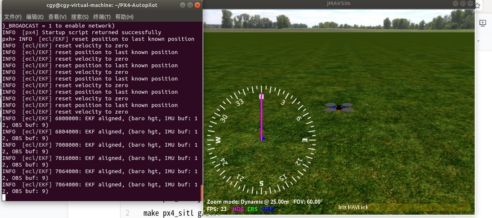
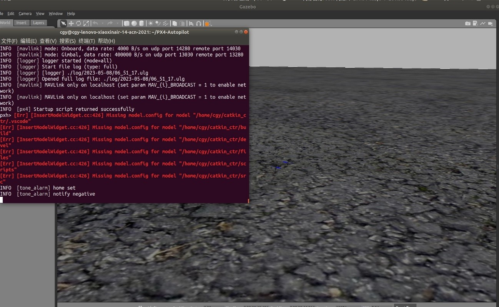

1.px4固件

cd PX4-Autopilot  

make px4_sitl jmavsim //jmavsim仿真环境

出现以下界面成功

make px4_sitl gazebo 

出现gazebo界面代表成功,有红色警告不用管

 

在上述两个步骤中，其中出现的错误解决步骤：

需要下载很多模块

sudo -H python3 -m pip install kconfiglib

sudo -H python3 -m pip install jinja2

sudo -H python3 -m pip install jsonschema

sudo -H python3 -m pip install empy

sudo -H python3 -m pip install pyros-genmsg

sudo -H python3 -m pip install packaging

sudo -H python3 -m pip install toml

sudo -H python3 -m pip install numpy

sudo -H python3 -m pip install future

直接google就有答案

sudo apt-get install ant

另外一个错误

sudo apt update

sudo apt install openjdk-11-jdk

2.安装mavros

使用二进制安装

sudo apt install ros-melodic-mavros ros-melodic-mavros-extras

wget https://raw.githubusercontent.com/mavlink/mavros/master/mavros/scripts/install_geographiclib_datasets.sh

chmod +x install_geographiclib_datasets.sh

sudo ./install_geographiclib_datasets.sh

出现错误：路径报错

.bashrc文件

source ~/PX4-Autopilot/Tools/setup_gazebo.bash ~/PX4-Autopilot/ ~/PX4-Autopilot/build/px4_sitl_default

export ROS_PACKAGE_PATH=$ROS_PACKAGE_PATH:~/PX4-Autopilot

export ROS_PACKAGE_PATH=$ROS_PACKAGE_PATH:~/PX4-Autopilot/Tools/sitl_gazebo

验证：

如果安装好mavros以后运行

roslaunch px4 mavros_posix_sitl.launch

3.安装qgc

找18.04对应的版本

 

1.具体仿真的操作步骤：

（1）在终端中输入命令：roslaunch px4 fast_test.launch；即打开了仿真环境

（2）打开qgc，无人机的控制软件

（3）进入catkin_ctr，先输入source ./devel/setup.bash；再输入cd scripts/；再输入sh mybot_gazebo.sh

将rviz和rqt工具箱和规划算法启动。

（4）再进行无人机的起飞操作，先点击takeoff，再调整起飞的高度，最小起飞高度为1.5，然后起飞

（5）先点击rqt界面的mode_bool，使得无人机进入offboard模式，再点击cmd_bool，使得无人机自动起飞。

 