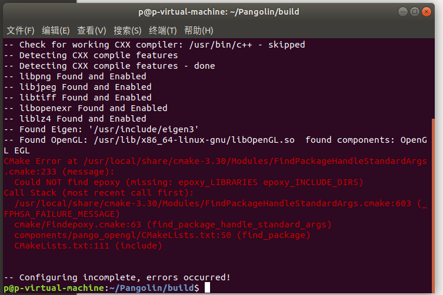
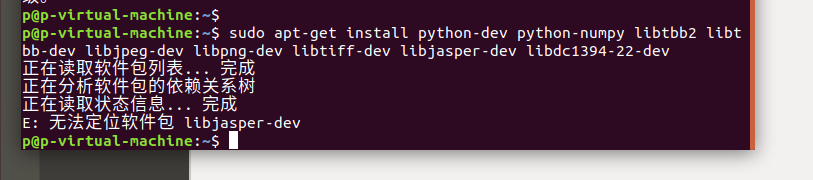

## 1. 安装git g++ gcc

sudo apt-get install git

sudo apt-get install g++ 

sudo apt-get install gcc

## 2. 安装cmake(3.22.1)

[Download CMake](https://cmake.org/download/)
 sudo apt-get install build-essential

tar -zxvf cmake-3.22.1.tar.gz

cd cmake-3.22.1/

./bootstrap
 sudo make install

## 3. 安装Pangolin 

h[ttps://pan.baidu.com/s/1yEQvArzHz35CUJc-BEmNiw](https://pan.baidu.com/s/1yEQvArzHz35CUJc-BEmNiw) 提取码: n6r8

先安装依赖：sudo apt-get install libglew-dev

sudo apt-get install libboost-dev libboost-thread-dev libboost-filesystem-dev

再安装：cd Pangolin

mkdir build

cd build

cmake ..

sudo make install

在cmake ..中出现报错：

解决：sudo apt-get install libepoxy-dev

## 4. 安装opencv 

先安装依赖：sudo apt-get install build-essential

sudo apt-get install cmake git libgtk2.0-dev pkg-config libavcodec-dev libavformat-dev libswscale-dev

sudo apt-get install python-dev python-numpy libtbb2 libtbb-dev libjpeg-dev libpng-dev libtiff-dev libjasper-dev libdc1394-22-dev

报错：无法定位软件包

解决：sudo add-apt-repository "deb http://security.ubuntu.com/ubuntu xenial-security main"

sudo apt-get update

sudo apt-get install libjasper-dev

安装：git clone https://github.com/opencv/opencv.git

cd opencv-3.4.15/

mkdir build

cd build

cmake -D CMAKE_BUILD_TYPE=Release -D CMAKE_INSTALL_PREFIX=/usr/local ..
 sudo make install

配置opencv编译环境：

## 5. 安装eigen（3.3.7）

[发布 · libeigen / eigen · GitLab](https://gitlab.com/libeigen/eigen/-/releases)  

cd eigen-3.3.7/

mkdir build

cd build

cmake ..

sudo make install
sudo cp -r /usr/local/include/eigen3/Eigen /usr/local/include

## 6. 安装ros（omit）（18.04）

https://blog.csdn.net/hxj0323/article/details/121215992

## 7. 创建工作空间catkin_ws

创建：mkdir -p ~/catkin_ws/src  //创建文件目录

cd ~/catkin_ws/src     //进入src

catkin_init_workspace    //初始化文件夹

编译：cd ~/catkin_ws/

catkin_make

设置环境变量：echo "source ~/catkin_ws/devel/setup.bash" >> ~/.bashrc

source ~/.bashrc

创建功能包：catkin_create_pkg learning_communication std_msgs roscpp rospy

编译：cd ~/catkin_ws

catkin_make

## 8. 安装orb-slam2

安装：git clone [https://github.com/raulmur/ORB_SLAM2.git ORB_SLAM2](https://github.com/raulmur/ORB_SLAM2.git ORB_SLAM2)

cd ORB_SLAM2

chmod +x build.sh

./build.sh

​    error：

[ubuntu18 配置ROS环境 运行 ORB-SLAM2_orbslam2 ubuntu18-CSDN博客](https://blog.csdn.net/qin_liang/article/details/127419612)（文件错误，在以下文件中添加）

在如下文件中添加：#include<unistd.h>

Examples/Monocular/mono_euroc.cc

Examples/Monocular/mono_kitti.cc

Examples/Monocular/mono_tum.cc

Examples/RGB-D/rgbd_tum.cc

Examples/Stereo/stereo_euroc.cc

Examples/ROS/ORB_SLAM2/src/AR/ViewerAR.cc

Examples/Stereo/stereo_kitti.cc

src/LocalMapping.cc

src/LoopClosing.cc

src/System.cc

src/Tracking.cc

src/Viewer.cc

[c++ error: ‘decay_t’ is not a member of ‘std’解决方法_c++ abs not a member of-CSDN博客](https://blog.csdn.net/Lkilvin/article/details/123054182)

在CmakeLists.txt中添加set(CMAKE_CXX_STANDARD 14)

## 9. 运行数据集

dataset download: https://vision.in.tum.de/data/datasets/rgbd-dataset/download

./Examples/Monocular/mono_tum Vocabulary/ORBvoc.txt Examples/Monocular/TUM1.yaml /home/p/dataset/rgbd_dataset_freiburg1_xyz